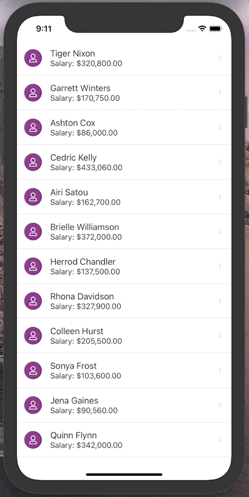

# React Native "Scroll to Top" button example

A quick example project that shows how to add a conditionally visible "scroll to top" button in a React Native app.

Check out [App.tsx](./App.tsx) for the code!

